GPU Rasterized And Ray Traced Real Time Rendering Using WebGL
======================

**University of Pennsylvania, CIS 565: GPU Programming and Architecture, Final Project**

* Yuru Wang, Wanru Zhao
* Tested on: **Google Chrome 62.0.3202.94** on Windows 10, i7-7700HQ @ 2.5GHz 128GB, GTX 1050 Ti 8GB (personal computer) and **Google Chrome 71.0.3578.80** Windows 10, Intel(R) Core(TM) i7-8750H CPU@2.2GHz, GTX 1070 with Max-Q Design(Personal Laptop)

### Live Online

### Demo Video/Gif

### Slides

## Project Description ##

## Results ##

**Texture mapping**
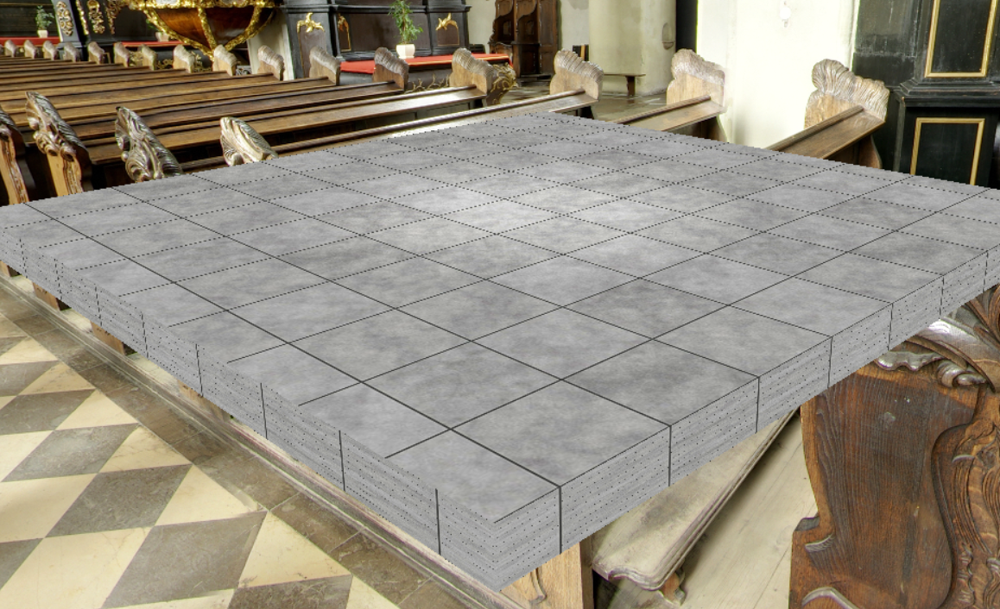

**OBJ loading**
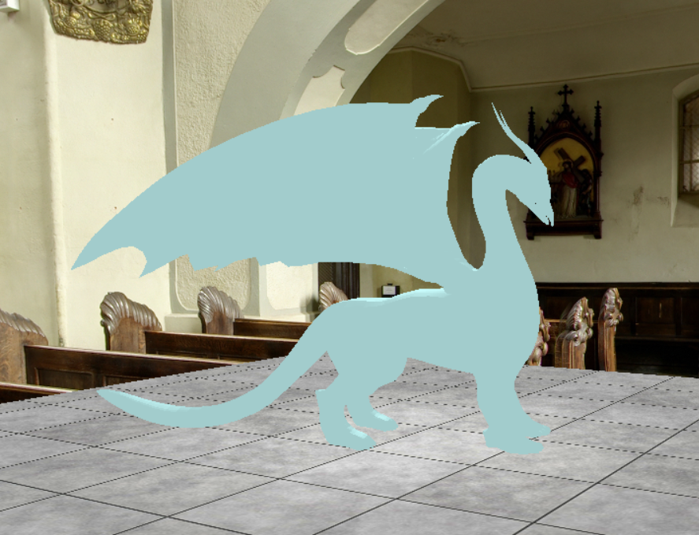

**Rasterization and GBuffer**

| Albedo | Material |
|------|------|
| 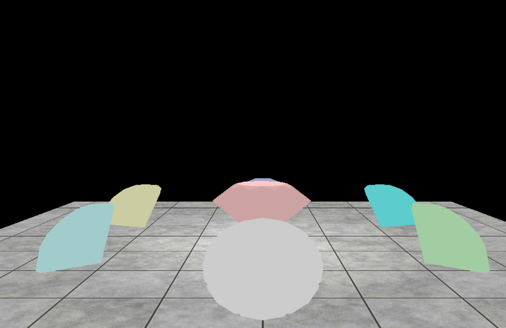 | 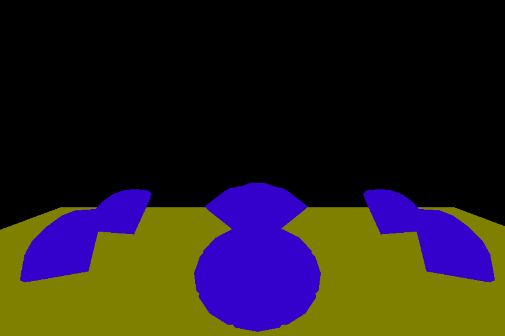 |

| Position | Normal |
|------|------|
| 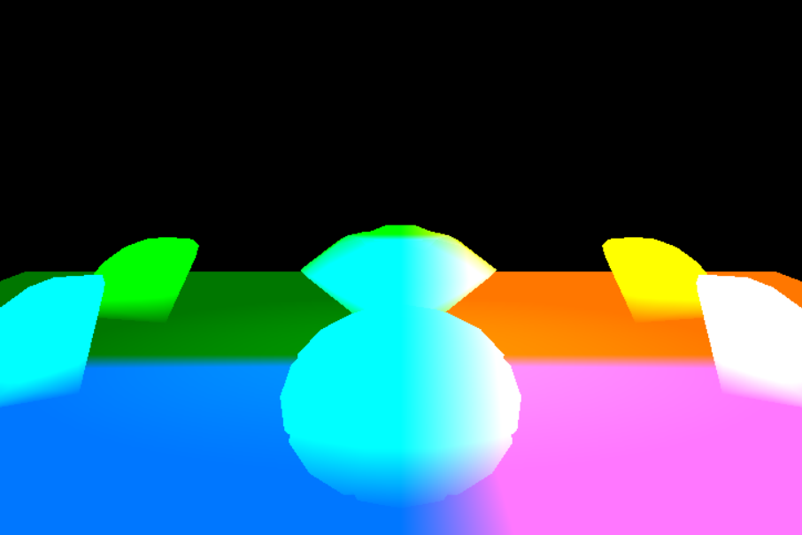 | 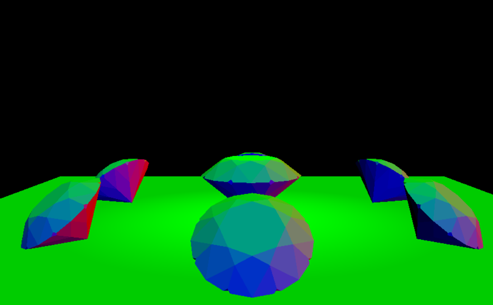 |

**Ray traced reflection pass**

| Ray depth = 2 | Ray Depth = 4 |
|------|------|
| 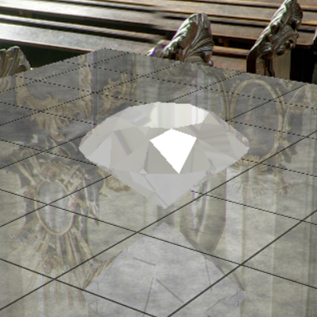 | 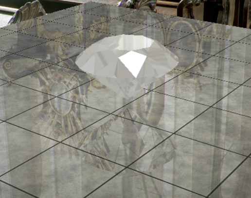 |

**Ray traced refraction pass**

| Ray depth = 2 | Ray Depth = 5 | Ray depth = 10 | Ray Depth = 20 |
|------|------|------|------|
| 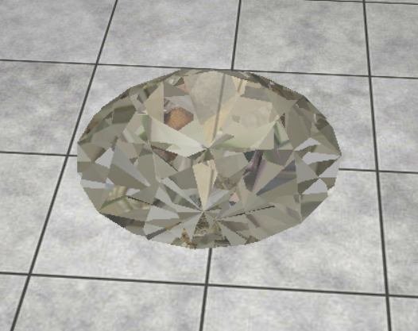 | 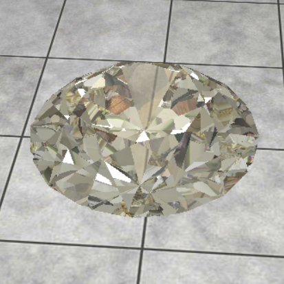 | 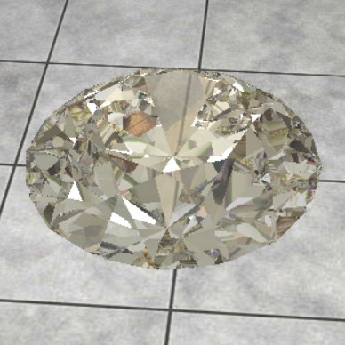 | 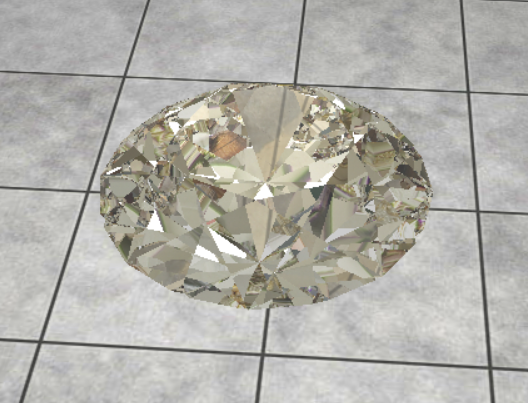 |

**Combine separate Passes**

| Direct Lighting | Ray Traced Refelection | Ray Traced Refraction | Combined |
|------|------|------|------|
| 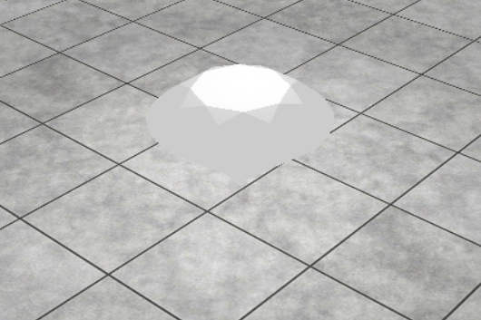 | 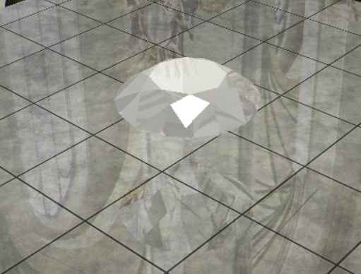 | 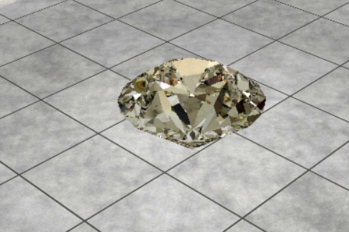 | 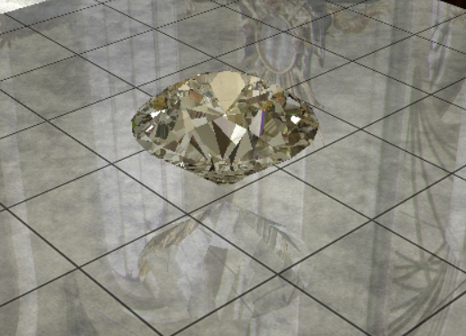 |

**BVH and KDTree**
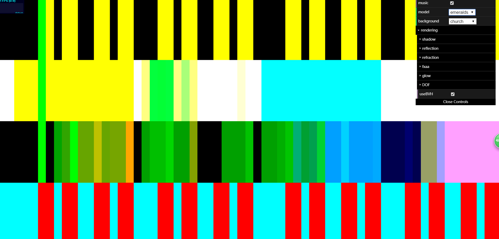

## Performance Analysis ##

### Credits

### Milestone 1 - 2018.11.19
- WebGL framework
- Basic deferred shading
- Raytraced shadow (hard)
- Raytraced direct lighting

